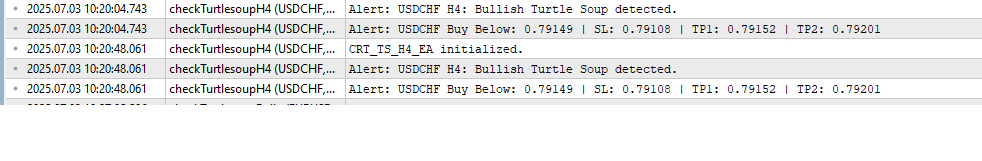

# Turtle Soup Detection EAs for MT5

This repository contains a suite of Expert Advisors (EAs) for MetaTrader 5 that detect high-quality Turtle Soup reversal setups across multiple timeframes—M15, H4, Daily, Weekly, and Monthly. Each EA scans over 60 instruments including forex pairs, indices, commodities, and crypto.

## What is Turtle Soup?
Turtle Soup is a reversal strategy based on false breakouts. These EAs detect such setups when:

- A candle breaks the previous high/low and then closes back inside
- The wick is significantly longer than the body (strong rejection)

## Included Files
- `CRTTS_M15.mq5` – 15-minute (M15), wick must be ≥ 3× candle body
- `CRTTS.mq5` – 4-hour (H4), wick must be ≥ 2× candle body. Also provides trade level alerts: Entry, SL, TP1, TP2.
- `CRTTS_Daily.mq5` – Daily (D1)
- `CRTTS_Weekly.mq5` – Weekly (W1)
- `CRTTS_Monthly.mq5` – Monthly (MN1)

All EAs send alerts only and do not place trades.

## When to Run
- **M15:** Can run continuously, best checked throughout sessions
- **H4:** Run at New York 1 AM, 5 AM, 9 AM or PM, shortly after each H4 candle opens
- **Daily:** Run at the start of the trading day
- **Weekly:** Run on Monday, after weekly open
- **Monthly:** Run at the beginning of each month

## How to Use in MT5
1. Open MetaTrader 5
2. Press F4 to open MetaEditor
3. Copy any `.mq5` file into the `MQL5/Experts` directory
4. In MetaEditor, right-click the file and select **Compile**
5. Return to MT5
6. Open the Navigator panel (Ctrl+N)
7. Drag the EA onto any chart
8. Enable **Algo Trading** (top toolbar button)

Alerts will be triggered whenever valid Turtle Soup patterns are detected.

## Screenshots

## Further Improvements
- Add timed triggers for H4 detection: check only during the first 30 minutes of each H4 candle, every 10 minutes
- Expand Turtle Soup detection to use multi-candle range breakouts (e.g., break of last 2–5 candles)
- Detect same-direction Turtle Soup (e.g., bullish breakout with a bullish long-wick candle)
- Add doji candle logic to filter out weak signals
- Add per-symbol memory to prevent repeated alerts per candle
- Combine all timeframe logic into one EA with toggle switches
- Introduce ATR filtering or additional candle quality filters
- Build an on-chart dashboard for signal display
- Optional email or push notifications for alerts
- Add logic to place actual orders when a Turtle Soup pattern is detected, with proper SL and TP settings

## Author
Created by **Neo Malesa**  
[X Profile](https://www.x.com/n30dyn4m1c)
